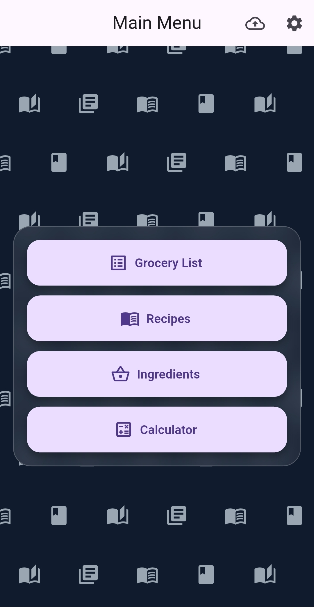
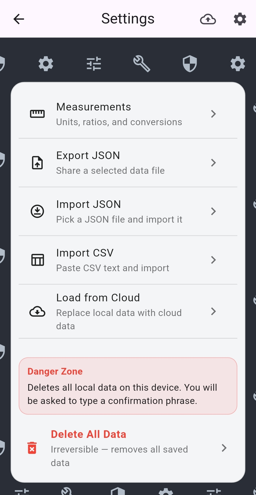
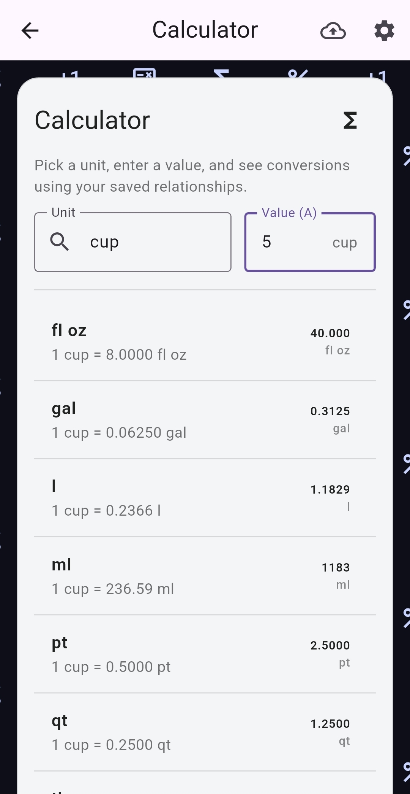
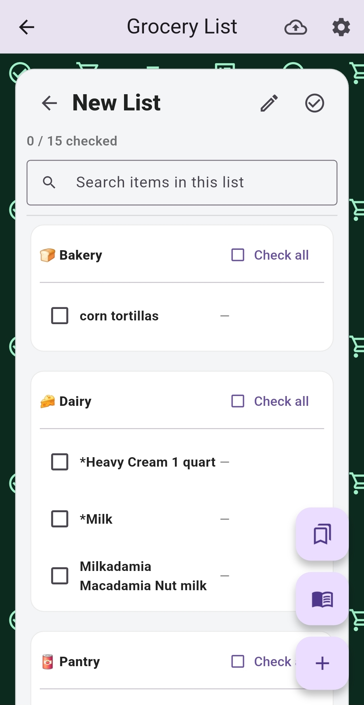
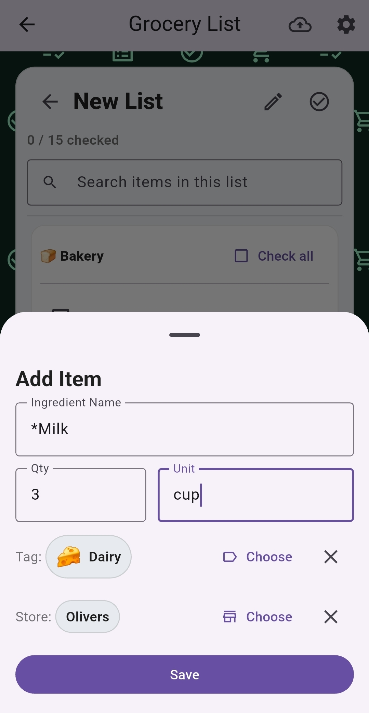
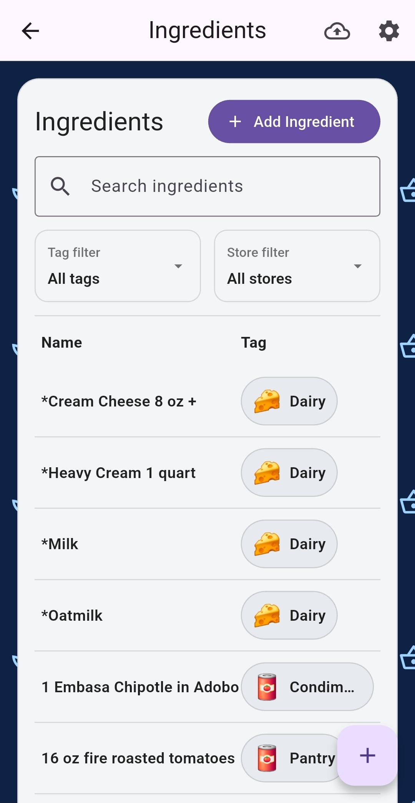
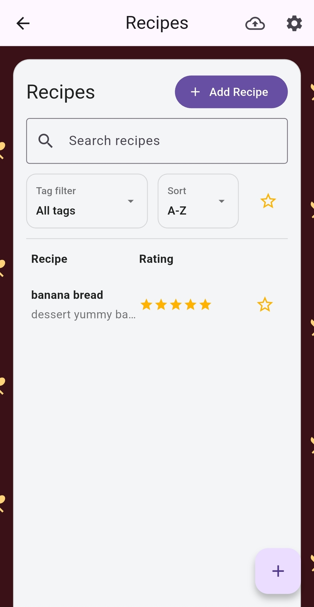
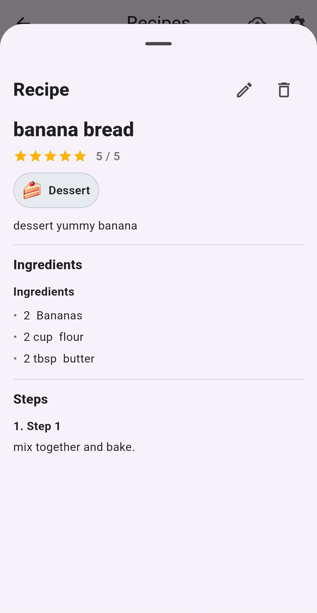

# Grocery & Recipe Planner

Grocery & Recipe Planner (GroceryList v2) is a comprehensive, feature-rich grocery shopping and recipe management application built with Flutter. It features dynamic physics-based animated backgrounds, custom unit conversion relationships, fuzzy search auto-completion, and local data backup import/export features.

## App Showcase

### 📅 Main Hub & Settings
| **Main Menu** | **Settings** | **Convert Measurements** |
| :---: | :---: | :---: |
|  |  |  |

### 🛒 Grocery Shopping
| **Grocery List** | **Add to List** | **Create & Add Groceries** |
| :---: | :---: | :---: |
|  |  |  |

### 🍳 Recipes & Cooking
| **Recipes Overview** | **Read Recipe** |
| :---: | :---: |
|  |  |

## Project Status

**This is a personal project.** It was built to serve specific personal grocery planning and cooking needs. The codebase is provided here "as is" for reference, but there is no active development, and **no future updates are planned.**

## Codebase Structure & File Descriptions

The `lib` directory is structured as a flat folder containing the following Dart source files:

* [main.dart](file:///c:/Users/gabri/Desktop/lib/main.dart) - Application entry point. Handles Firebase initialization for Web/Windows platforms and launches the main application.
* [screen_main.dart](file:///c:/Users/gabri/Desktop/lib/screen_main.dart) - The core application interface, orchestrating the main menu panel layout, page navigation, and panels for Grocery Lists, Recipes, Ingredients, Measurements/Calculator, and Settings.
* [grocerylist.dart](file:///c:/Users/gabri/Desktop/lib/grocerylist.dart) - Contains the data model classes and logic for managing grocery list items, tags, active lists, archived lists, and templates.
* [ingredient.dart](file:///c:/Users/gabri/Desktop/lib/ingredient.dart) - Defines the data models for ingredients, tag info, and custom store tag categories.
* [recipe.dart](file:///c:/Users/gabri/Desktop/lib/recipe.dart) - Models recipe definitions, rating scores, ingredient sections, preparation steps, and custom tags.
* [measurements.dart](file:///c:/Users/gabri/Desktop/lib/measurements.dart) - Handles unit conversions, custom unit definitions, and conversion ratios.
* [fuzzy_search.dart](file:///c:/Users/gabri/Desktop/lib/fuzzy_search.dart) - Implements local fuzzy-search scoring algorithms for ingredient lists, grocery items, and recipes.
* [background_generator.dart](file:///c:/Users/gabri/Desktop/lib/background_generator.dart) - A custom physics-based widget (`MovingIconBackground`) that renders a grid of animated floating icons in the background of the main menu.

## Notes

- **Firebase Configuration:** The project uses Firebase to support sync operations. For security, all credentials and project IDs have been sanitized and replaced with placeholders (e.g. `YOUR_API_KEY`, `YOUR_APP_ID`). If you wish to build or run this project yourself, you will need to replace these placeholders in `main.dart` with your own Firebase Project configuration values.
- **Local Persistence:** Data is serialized to and from local JSON files (`grocery_lists.json`, `recipe_store.json`, `measurement_store.json`, `ingredient_store.json`) inside the application documents directory, utilizing a debounce mechanism to ensure changes are saved efficiently in the background.
